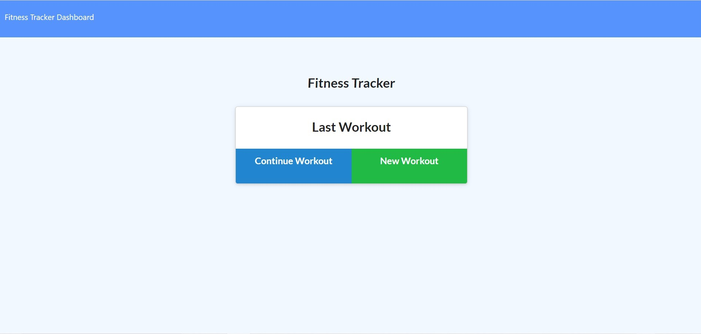

# Workout-Tracker

## What it does
The consumer will reach their fitness goals more quickly when they track their workout progress. They are able to keep track of daily workouts, and log multiple workouts in a given day.

## Installation
When you run the app run `npm i` and `npm start` to start the application.

The following image shows the application.

## How it works
You are able to:

  * Add exercises to the most recent workout plan.

  * Add new exercises to a new workout plan.

  * View the combined weight of multiple exercises from the past seven workouts on the `stats` page.

  * View the total duration of each workout from the past seven workouts on the `stats` page.

## Contact
Reach out to me at 27aubreyb@gmail.com
